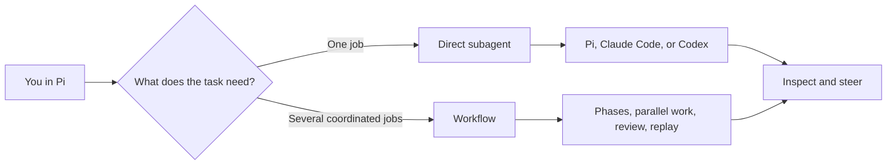
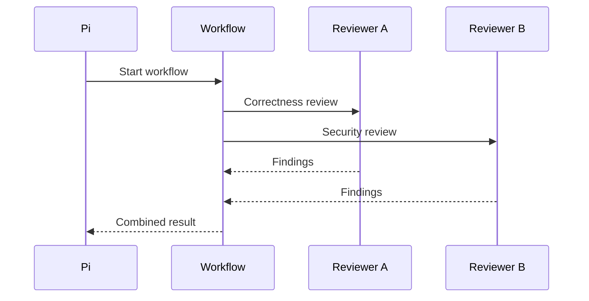
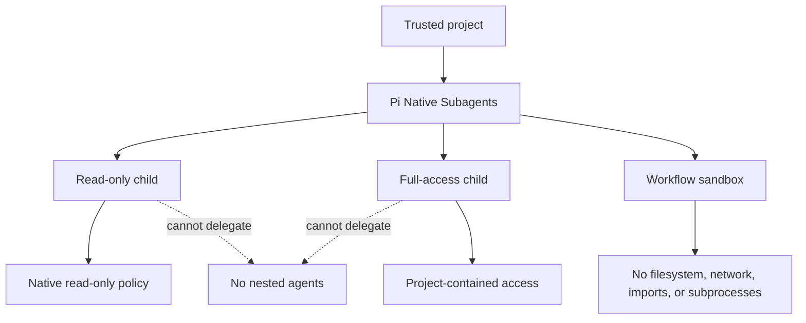

# Pi Native Subagents

Run coding agents from Pi using Pi, Claude Code, or Codex. Send one agent a focused task, or coordinate several agents in a sandboxed workflow.



Use the dashboards to see what is running, inspect results, steer retained sessions, or take over a job.

## Install

Requires Node.js 22.19.0 or newer.

```bash
pi install git:github.com/vorsakha/pi-native-subagents@main
```

Pi extensions run with your user permissions. Review the package before installing it.

Keep one package source installed. If Pi loads the package twice, remove the duplicate. Update the existing Git source instead of adding a local checkout beside it.

## Start with one task

Ask Pi in plain language:

> Spawn a read-only subagent to review `src/auth.ts` for missing error handling.

Pi starts the job in the background and returns a job ID. You can also start one yourself:

```text
/subagent --access readOnly "Review src/auth.ts for missing error handling"
```

Open `/subagents` to inspect progress, steer the agent, or take over its native session.

## Coordinate several tasks

Use a workflow when jobs need phases, bounded parallel work, shared results, or replay.

```js
export const meta = { name: "parallel-review" };

export default async function () {
  phase("review");

  const reviews = await parallel(
    [
      () => agent("Review the API for correctness.", {
        access: "readOnly",
      }),
      () => agent("Review the API for security risks.", {
        access: "readOnly",
        independent: true,
      }),
    ],
    { concurrency: 2 },
  );

  return {
    ok: reviews.every((review) => review.ok),
    reviews,
  };
}
```



## Direct job or workflow?

| You want to | Start with |
| --- | --- |
| Hand off one focused task | Ask Pi or run `/subagent` |
| Run a few unrelated jobs | Several direct subagents |
| Coordinate phases or combine results | A workflow |

Pi uses its configured default provider unless you choose another one. `/subagents providers` shows which providers are installed, signed in, and ready.

## Commands

```text
/subagent [--harness pi|claude|codex] [--model ID] [--effort LEVEL]
          [--access readOnly|full] [--cwd DIR] [--profile NAME]
          [--max-tokens N] [--max-cost USD] [--max-turns N]
          [--independent] [--independent-of JOB] <task>

/subagents [status|profiles|providers [refresh]|capabilities [refresh]]
/subagents [pi|claude|codex]
/subagents-config [status|pi|claude|codex]
/workflows
```

Add `refresh` to rerun the provider or capability checks.

## Safety boundaries



Children must stay inside a trusted project. Read-only jobs use the native runtime's sandbox instead of relying on prompt instructions. Children cannot start more agents or approve permission changes. Workflow scripts run in a separate restricted process.

Transcripts, artifacts, credentials, and machine-local state stay outside Git. Report security problems through GitHub's private vulnerability reporting. See [SECURITY.md](SECURITY.md).

## Agent instructions

Pi loads the bundled [package skill](skills/pi-native-subagents/SKILL.md), which contains the model-facing tool contract and workflow authoring rules.

## Contributing

Run the full local check before opening a pull request:

```bash
npm run check
```

Smoke tests verify provider authentication and access policy:

```bash
npm run smoke
npm run smoke:pi
npm run smoke:claude
npm run smoke:codex
npm run smoke:access:claude
npm run smoke:access:codex
```

They spend model turns only when `PI_NATIVE_SUBAGENTS_LIVE=1` is set. Contributor conventions are in [AGENTS.md](AGENTS.md). This project is experimental, so only claim compatibility you have tested.

## License

MIT
